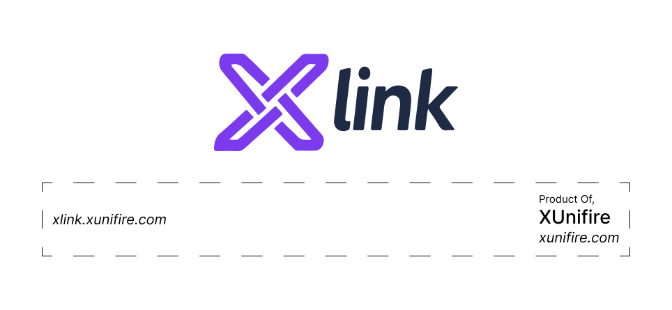

  
  &nbsp;&nbsp;
  
  &nbsp;&nbsp;
  

<!-- PROJECT LOGO & HEADER -->
 
 

  

 
 

    <strong>An All-in-One URL Shortening, QR Code Generation, and Secure File Sharing Platform</strong>
     
    Simplify digital workflows, distribute assets effortlessly, and monitor real-time usage analytics.
     
     
    
    &nbsp;&nbsp;
    
    &nbsp;&nbsp;
    
  

 

<!-- TABLE OF CONTENTS / NAVIGATION AT TOP -->
<h3 align="center"></h3>

  <a href="#-overview">Overview</a> •
  <a href="#-about-xlink">About XLink</a> •
  <a href="#-use-of-xlink">Use of XLink</a> •
  <a href="#-problems-solved-by-xlink">Problems Solved</a> •
  <a href="#-features">Features</a> •
  <a href="#-how-the-platform-works">How It Works</a> •
  <a href="#-contact">Contact</a>

### 

XLink is an innovative digital platform developed and maintained by **XUnifire**, a technology company focused on building modern, secure, and user-friendly software solutions. With a commitment to simplifying digital workflows, it delivers reliable and seamless experiences for both individuals and businesses.

  

As an all-in-one solution, XLink combines short URL generation, QR code creation, and secure file sharing into a single platform. It enables users to share content easily while providing useful analytics and dashboard features to manage and track all shared assets efficiently.

### 

XLink is built to simplify the way people share digital content. Whether you need to shorten a lengthy URL, create a printable QR code, or securely distribute files through downloadable links, XLink provides everything in one platform. Its intuitive interface allows users to generate and share resources within seconds without requiring technical knowledge.

For users who create an account, XLink unlocks premium capabilities including a personal dashboard, saved history, customizable links, detailed analytics, and centralized management of URLs, QR codes, and file-sharing records. The platform is designed with security, scalability, and ease of use in mind, making it suitable for businesses, educators, marketers, and everyday users.

### Key Highlights

- All-in-one URL shortening, QR code generation, and file sharing platform
- Fast and simple user interface
- Secure encrypted data storage
- Customizable short URLs
- Downloadable QR Codes
- File sharing through short links or QR codes
- Real-time analytics
- Personal dashboard for registered users
- Cloud-based infrastructure
- Automatic cleanup of inactive assets after 7 days

### 

### Why Use XLink?

Sharing long URLs, distributing files, and creating QR codes often requires multiple platforms. Managing these services separately can be inconvenient, time-consuming, and difficult to track.

XLink solves this problem by bringing everything together into one secure platform.

### How to Use XLink

#### Short URLs

1. Enter or paste your long URL.
2. Click **Generate Short URL**.
3. Copy and share the generated link anywhere.
4. Optionally customize your short URL.
5. Login to save the URL and monitor analytics.

#### QR Code Generation

1. Enter or paste your destination URL.
2. Click **Generate QR Code**.
3. Download the QR code.
4. Print or share it digitally.
5. Login to save and monitor QR code performance.

#### File Sharing

1. Upload your file securely.
2. Choose whether to generate a Short URL or QR Code.
3. Share the generated download link.
4. Recipients simply open the link or scan the QR code to download the file.
5. Monitor downloads and engagement from your dashboard.

### 

- Eliminates long and difficult-to-share URLs.
- Creates professional-looking shareable links.
- Makes QR code generation quick and effortless.
- Allows secure file sharing without complicated setups.
- Tracks user engagement through analytics.
- Stores and manages all shared assets in one dashboard.
- Reduces dependency on multiple online tools.
- Improves offline sharing through printable QR codes.
- Provides encrypted storage for enhanced security.
- Automatically removes inactive assets to optimize storage.

### 

### URL Shortener

- [x] Instant Short URL generation
- [x] Custom Short URLs
- [x] Easy copy and share
- [x] Works across websites, SMS, WhatsApp, email, and social media
- [x] Secure encrypted URL storage

### QR Code Generator

- [x] High-quality QR Code generation
- [x] Downloadable QR Codes
- [x] Printable QR Codes
- [x] Supports online and offline sharing
- [x] Customizable QR code destination

### Secure File Sharing

- [x] Upload files securely
- [x] Generate downloadable Short URLs
- [x] Generate downloadable QR Codes
- [x] Fast cloud-based file delivery
- [x] Encrypted cloud storage

### Dashboard Features

- [x] Save Short URLs
- [x] Save QR Codes
- [x] Save File Sharing records
- [x] Manage all assets in one place
- [x] View complete history

### Analytics

- [x] Total Traffic
- [x] Unique Visitors
- [x] Last Opened Date
- [x] Performance monitoring
- [x] Usage insights

### Security

- [x] Encrypted URL storage
- [x] Encrypted cloud file storage
- [x] Secure request handling
- [x] Protected download links

### Automatic Data Management

- [x] Seven-day inactivity cleanup policy

### 

XLink is designed with security, performance, and simplicity at its core.

### URL Shortening Workflow

1. User enters a long URL.
2. The original URL is securely encrypted.
3. The encrypted URL is stored in the database.
4. A unique short URL is generated.
5. The user shares the generated link.
6. When someone opens the short URL:
   - The server receives the request.
   - Traffic statistics are updated.
   - Unique visitor count is updated.
   - Last opened timestamp is recorded.
   - The original destination is decrypted.
   - The user is redirected to the original website.

### QR Code Workflow

1. User submits a destination URL.
2. XLink generates a Short URL.
3. A QR Code is created for the generated short link.
4. The QR Code can be downloaded or printed.
5. When scanned:
   - Analytics are updated.
   - Destination URL is decrypted.
   - User is redirected automatically.

### File Sharing Workflow

1. User uploads a file.
2. The file is encrypted before storage.
3. The encrypted file is securely stored in cloud storage.
4. The system generates either:
   - A downloadable Short URL, or
   - A downloadable QR Code.
5. The owner shares the generated resource.
6. When another user accesses the shared link:
   - The request reaches the server.
   - Download analytics are updated.
   - Traffic and unique visitors are recorded.
   - Last opened time is updated.
   - The encrypted file is decrypted.
   - File download begins automatically.

### Automatic Asset Cleanup

To maintain optimal performance and storage efficiency, XLink automatically removes stored URLs, QR codes, and uploaded files that have not received any access for the previous **7 consecutive days**.

Assets that continue receiving traffic remain securely stored and fully accessible, ensuring that only inactive resources are removed while frequently used content stays available.

### 

For support, technical assistance, feature requests, or business inquiries, please contact:

**Email:** [support@xunifire.com](mailto:support@xunifire.com)

[**XLink**](https://xlink.xunifire.com/) is proudly developed, maintained, and owned by [**XUnifire**](https://www.xunifire.com/). All rights reserved.

<!-- MARKDOWN LINKS & IMAGES REFERENCE -->

[contributors-shield]: https://img.shields.io/github/contributors/sarthak-dhaduk/xlink.svg?style=for-the-badge
[contributors-url]: https://github.com/sarthak-dhaduk/xlink/graphs/contributors
[forks-shield]: https://img.shields.io/github/forks/sarthak-dhaduk/xlink.svg?style=for-the-badge
[forks-url]: https://github.com/sarthak-dhaduk/xlink/network/members
[stars-shield]: https://img.shields.io/github/stars/XUnifire/XLink.svg?style=for-the-badge
[stars-url]: https://github.com/XUnifire/XLink/stargazers
[issues-shield]: https://img.shields.io/github/issues/XUnifire/XLink.svg?style=for-the-badge
[issues-url]: https://github.com/XUnifire/XLink/issues
[linkedin-shield]: https://img.shields.io/badge/-LinkedIn-black.svg?style=for-the-badge&logo=linkedin&colorB=555
[linkedin-url]: https://www.linkedin.com/company/xunifire/
